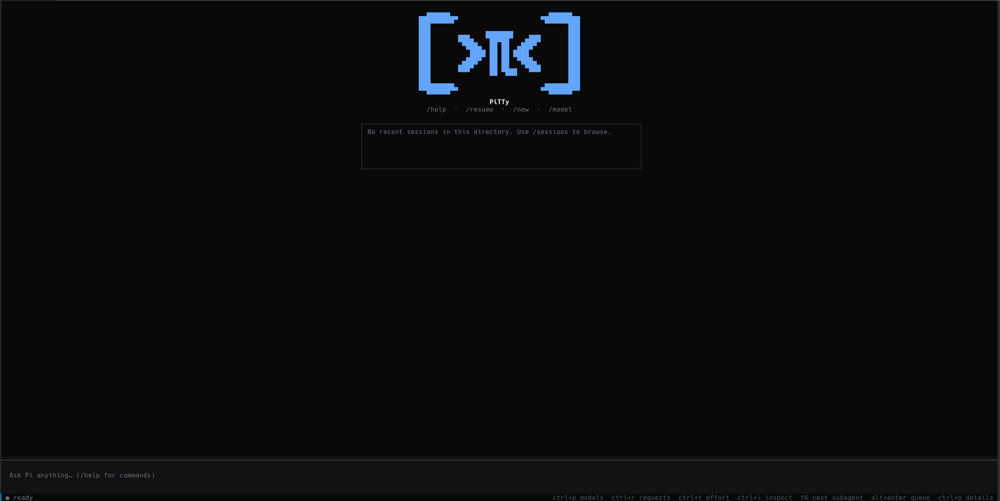
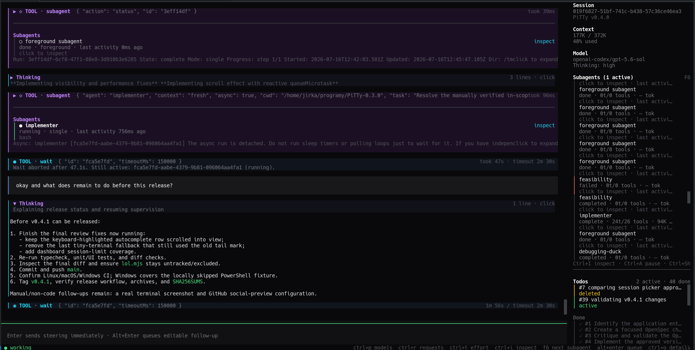

<p align="center">
  <picture>
    <source media="(prefers-color-scheme: dark)" srcset="docs/images/pitty-logo-dark.svg">
     π <]">
  </picture>
</p>

<h1 align="center">PiTTy</h1>

<p align="center">
  <strong>A fast, terminal-native OpenTUI frontend for the Pi coding agent.</strong>
</p>

<p align="center">
  Scrollable conversations · searchable sessions and models · live themes · rich tool output · optional subagent, Todo, and MCP views
</p>

<p align="center">
  <a href="https://github.com/mistrjirka/PiTTy/actions/workflows/ci.yml"></a>
  <a href="https://github.com/mistrjirka/PiTTy/releases"></a>
  <a href="LICENSE"></a>
</p>

## Install

### Linux, macOS, and WSL

```bash
curl -fsSL https://raw.githubusercontent.com/mistrjirka/PiTTy/main/install.sh | sh
```

Then start PiTTy in the current project:

```bash
pitty
```

Requirements: Node.js 22.19 or newer, npm, and the Pi CLI. The installer validates them, downloads a versioned release, requires and verifies the selected archive's SHA-256 entry in the release `SHA256SUMS` file, installs PiTTy's local Bun runtime, and creates the `pitty` and `pitty-resume` launchers.

### Windows PowerShell

```powershell
irm https://raw.githubusercontent.com/mistrjirka/PiTTy/main/install.ps1 -OutFile $env:TEMP\pitty-install.ps1
& $env:TEMP\pitty-install.ps1 -WithPlugins
```

<details>
<summary><strong>Installer options and manual source installation</strong></summary>

The POSIX installer can include or skip the optional integrations without prompting:

```bash
curl -fsSL https://raw.githubusercontent.com/mistrjirka/PiTTy/main/install.sh -o /tmp/pitty-install.sh
sh /tmp/pitty-install.sh --yes --with-plugins
sh /tmp/pitty-install.sh --without-plugins
```

Custom paths and versions are supported through installer flags or `PITTY_INSTALL_DIR`, `PITTY_BIN_DIR`, `PITTY_VERSION`, and `PITTY_REPO`.

To run directly from source:

```bash
git clone https://github.com/mistrjirka/PiTTy.git
cd PiTTy
npm ci --ignore-scripts --no-audit --no-fund
node node_modules/bun/install.js
npm run typecheck
node bin/pitty.mjs
```

</details>

## FAQ

<details>
<summary><strong>Is PiTTy a regular Pi extension or an alias for <code>pi -e pitty</code>?</strong></summary>

No. `pitty` starts a separate OpenTUI frontend and launches the installed Pi CLI using `--mode rpc`. Pi owns the agent runtime; PiTTy owns the terminal interface.

</details>

<details>
<summary><strong>How was PiTTy built, and is its UI declarative/reactive?</strong></summary>

PiTTy is written in TypeScript using OpenTUI's SolidJS binding and runs with a local Bun runtime. The UI is composed in JSX and updates through Solid signals, so it uses a declarative, fine-grained reactive model rather than manually redrawing component trees.

</details>

<details>
<summary><strong>Why was this not built as a regular Pi extension?</strong></summary>

Pi extensions can replace headers, footers, widgets and editors, add overlays, and render extension-owned tools and messages. They do not currently expose a supported hook to replace Pi's whole root layout or every built-in transcript row.

PiTTy needs control of the full screen for its fixed editor, independently scrollable and windowed transcript, persistent side panels, separate subagent conversations, and global focus and mouse behavior. Fixed-editor and scrolling extensions improve Pi's existing TUI; PiTTy replaces the frontend.

</details>

<details>
<summary><strong>Does PiTTy interfere with the normal Pi installation?</strong></summary>

No. PiTTy installs separately and does not replace the `pi` executable. It intentionally shares Pi's configuration, credentials, models, extensions and sessions, so `pi` and `pitty` can be used alongside each other.

The installer can optionally install `pi-subagents` and `@juicesharp/rpiv-todo` through `pi install`; this can be skipped with `--without-plugins`. Uninstalling PiTTy does not uninstall Pi or those packages.

</details>

<details>
<summary><strong>Does PiTTy support existing Pi extensions, and what is currently unsupported?</strong></summary>

The goal is to support Pi's existing extension ecosystem rather than create an incompatible replacement. PiTTy currently supports commands, tools, prompt templates, skills, notifications, status updates, textual widgets, editor prefilling, and standard select, confirm, input and editor dialogs exposed through RPC.

Arbitrary `pi-tui` component trees are not serialized through RPC, so extension-owned custom renderers, headers, footers, editors, overlays and autocomplete UIs cannot yet appear exactly as they do in Pi. Their commands and tools generally still work through PiTTy's generic rendering. Native interactive `/login` must also currently be completed in regular Pi.

</details>

<details>
<summary><strong>Does PiTTy have its own UI plugin API?</strong></summary>

Not yet. PiTTy has internal adapters for `pi-subagents` and `rpiv-todo`, but it does not expose a stable third-party UI API for adding panels or renderers.

Creating a second incompatible plugin ecosystem is not the goal. The initial priority was stabilizing the frontend and supporting the Pi extensions used during development. Future work should prefer compatibility with original Pi extensions and add adapters only where RPC does not carry enough UI structure.

</details>

## What PiTTy is

PiTTy is an independent frontend for the [Pi coding agent](https://github.com/earendil-works/pi). It keeps Pi's authentication, providers, models, sessions, tools, skills, prompt templates, and extensions while replacing Pi's built-in interactive terminal interface with a scrollable and inspectable OpenTUI application.

It starts directly in the normal chat. An empty conversation shows a passive dashboard with common commands and recent sessions while the prompt remains focused and writable.

<p align="center">
  
</p>

## Why use PiTTy instead of Pi's built-in TUI?

- **Inspect subagent chats separately.** Open each child agent's live transcript without losing the main conversation, with active agents grouped first and stable ordering within each group.
- **Control work while it runs.** Send steering, see it queued until pi-subagents picks it up, queue editable follow-ups, and pause or stop supported file-backed subagents from the same interface.
- **Keep the workspace calmer.** The prompt stays fixed while the transcript scrolls independently; thinking, tool output, pending input, suggestions, Todos, and the sidebar stay bounded or collapsible instead of taking over the terminal.
- **Read code changes more clearly.** Edit/write tools get dedicated diff views, arbitrary tools retain structured cards, and long streaming conversations use stable windowed rendering.
- **Navigate faster.** Search models and sessions, resume work in place, jump through earlier requests, and recover submitted or cleared prompts from session-local history.
- **Keep Pi's ecosystem.** PiTTy still uses Pi's authentication, providers, models, sessions, tools, skills, prompt templates, and extensions through RPC.

## Highlights

| Area | What PiTTy adds |
|---|---|
| Conversation | Fixed prompt, independently scrollable transcript, Markdown output, collapsible thinking, and long-session windowing |
| Tools | Expandable tool cards, timings, readable errors, edit/write diffs, and a generic fallback for arbitrary Pi tools |
| Navigation | Searchable model selector, `/sessions` and `/resume`, request map, command autocomplete, and on-demand older history |
| Workflow | Immediate steering with visible queued guidance, editable local follow-ups, prompt-focus recovery, and diagnostics bundles |
| Settings | Pi-authoritative model, thinking, and session controls; process-local presentation preferences; ten live theme presets and complete color editing |
| Optional views | Parallel subagent inspection/control, active/completed Todo panels, and safe MCP server management when their Pi packages are installed |

## Interface preview

<p align="center">
  
</p>

## Quick usage

```bash
pitty                              # start in the current directory
pitty -C /path/to/project          # choose a project directory
pitty -c                           # continue the newest Pi session
pitty --session /path/to/file.jsonl
pitty-resume -C /path/to/project   # open the session picker immediately
pitty --help
```

Inside PiTTy:

```text
/settings    open PiTTy Settings
/resume      browse and switch current-project sessions
/model       show or change the current model
/thinking    show or change reasoning effort
/commands    list Pi extensions, templates, and skills
/help        show PiTTy commands and controls
```

See the complete [usage and controls guide](docs/USAGE.md).

## Controls

| Key | Action |
|---|---|
| `Enter` | Accept the highlighted slash suggestion first; otherwise submit or steer immediately |
| `Shift+Enter` | Insert a newline |
| `Alt+Enter` | Queue an editable local follow-up |
| `Alt+Up` | Restore the latest local follow-up to the editor |
| `Up` / `Down` on an empty single-line prompt | Browse session-local prompt history |
| `Ctrl+C` with a nonempty draft | Clear the draft and save it to prompt history |
| Mouse wheel / `PgUp` / `PgDn` | Scroll the active transcript |
| `Ctrl+Home` / `Ctrl+End` | Jump to the beginning or latest message |
| `Ctrl+P` | Open the searchable model selector; PiTTy requests the current list from Pi each time it opens |
| `Ctrl+X` | Open Settings: model, thinking, session, theme, and MCP controls |
| `Ctrl+T` / `Shift+Tab` | Cycle thinking effort |
| `Ctrl+R` | Open the request map |
| `Ctrl+S` | Toggle the sidebar |
| `Ctrl+O` | Expand or collapse tool and thinking details |
| `Ctrl+I` | Open or close the selected subagent inspector |
| `F6` / `Shift+F6` | Select the next or previous subagent (active grouped first, stable within groups) |
| `Esc` | Close the active dialog/inspector or abort the current Pi turn |

## Settings, themes, and MCP

Open Settings with `Ctrl+X` or `/settings`. Changes to models, thinking effort, and sessions use Pi's authoritative RPC state; Settings retains the previous authoritative value and displays an inline error if an operation fails.

Theme selection and color editing are PiTTy-only user-global preferences. Choose one of ten presets or edit every semantic color token; valid `#RRGGBB` colors apply immediately, while invalid intermediate input remains in the field without changing the live palette. See [theme sources, contrast guidance, and storage details](docs/THEMES.md).

MCP server management is intentionally bounded to the standard project `.mcp.json` and global `~/.config/mcp/mcp.json` scopes. Settings shows the affected path and a before/after preview, preserves unknown config content, warns before command execution or plaintext values, and restarts the same Pi session after saving. It never sends the adapter's `/mcp` or `/mcp setup` custom panels through RPC.

## Optional integrations

PiTTy works without extra Pi packages. These integrations add specialized panels when installed:

| Package | Adds |
|---|---|
| `npm:pi-subagents` | Parallel child-agent list, live transcript inspection, pause/stop, and queued steering visibility |
| `npm:@juicesharp/rpiv-todo` | Bounded active and completed Todo panels |
| `npm:pi-mcp-adapter` | Optional adapter used by Settings to activate standard MCP config changes |

```bash
pi install npm:pi-subagents
pi install npm:@juicesharp/rpiv-todo
pi install npm:pi-mcp-adapter
```

The installer and upgrades offer missing optional integrations according to the selected plugin preference. Missing integrations leave the generic chat usable.

## Compatibility

PiTTy's RPC layer handles standard user, assistant, thinking, tool-call, and tool-result events; arbitrary tools; Pi extension commands; prompt templates and skills; extension dialogs; notifications; status updates; terminal-title changes; and editor prefilling.

Pi extensions that render arbitrary direct TUI components cannot be reproduced exactly because those component trees are not serialized through RPC. Their commands and tool events can still work through PiTTy's generic fallback, while richer behavior requires an optional adapter.

See [Open-source readiness and architecture](docs/OPEN_SOURCE_READINESS.md).

## Updates and upgrades

PiTTy checks GitHub Releases asynchronously at startup; set `PITTY_NO_UPDATE_CHECK=1` to disable it.

```bash
pitty upgrade --check          # inspect availability
pitty upgrade                  # stage the newest stable release
pitty upgrade --version 0.4.1  # choose an explicit version
```

Upgrades require the selected archive's SHA-256 entry in `SHA256SUMS`, stage replacement in a sibling `.pending` directory, activate on the next normal start, and roll back if activation validation fails.

## Uninstall

Optional Pi packages are left installed.

```bash
# Linux, macOS, WSL
~/.local/share/pitty/uninstall.sh
```

```powershell
# Windows PowerShell
& "$env:LOCALAPPDATA\PiTTy\app\uninstall.ps1"
```

Custom installations can set `PITTY_INSTALL_DIR` and `PITTY_BIN_DIR`, or pass `-InstallDir` and `-BinDir` to `uninstall.ps1`.

## Diagnostics and privacy

Diagnostics are stored under:

```text
~/.local/state/pitty/
```

Normal RPC logs omit prompt text, tool output, and source contents; they retain metadata, lengths, and short hashes. Absolute paths and error snippets can still appear, so inspect bundles before sharing them.

```bash
npm run diagnostics
```

Do not publish Pi credentials, session transcripts, private source code, or unreviewed `--verbose-rpc-logs` output. Security reporting guidance is in [SECURITY.md](SECURITY.md).

## Development

```bash
npm ci --ignore-scripts --no-audit --no-fund
node node_modules/bun/install.js
npm run typecheck
npm run test:unit
```

Larger public behavior changes should include an OpenSpec change under `openspec/changes/`. Contributor guidance is in [CONTRIBUTING.md](CONTRIBUTING.md).

## Documentation

- [Usage and controls](docs/USAGE.md)
- [Themes](docs/THEMES.md)
- [Architecture and compatibility](docs/OPEN_SOURCE_READINESS.md)
- [Documentation index](docs/README.md)
- [Changelog](CHANGELOG.md)

## Platform status

| Platform | Status |
|---|---|
| Linux | Primary development platform |
| macOS | Included in CI and supported by the POSIX installer |
| Windows | Included in CI and supported by `install.ps1`; terminal behavior still benefits from wider real-world testing |
| WSL | Supported through the POSIX installer and Linux runtime |

Tagged releases are packaged by GitHub Actions as `pitty-<version>.tar.gz`, `pitty-<version>.zip`, and `SHA256SUMS`.

## License

MIT. See [LICENSE](LICENSE).

PiTTy is not affiliated with the Pi or OpenCode maintainers.
