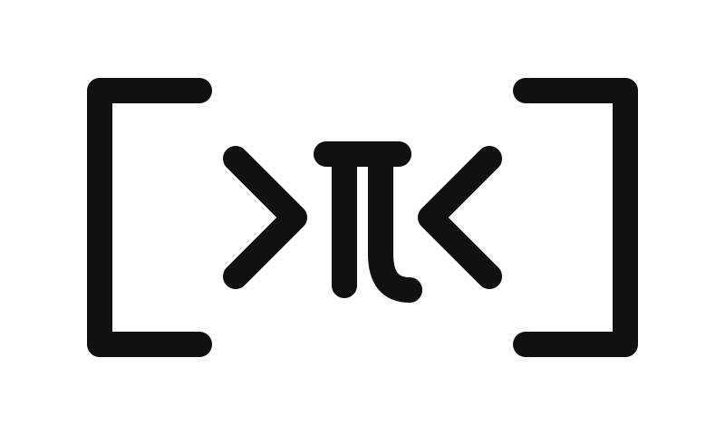
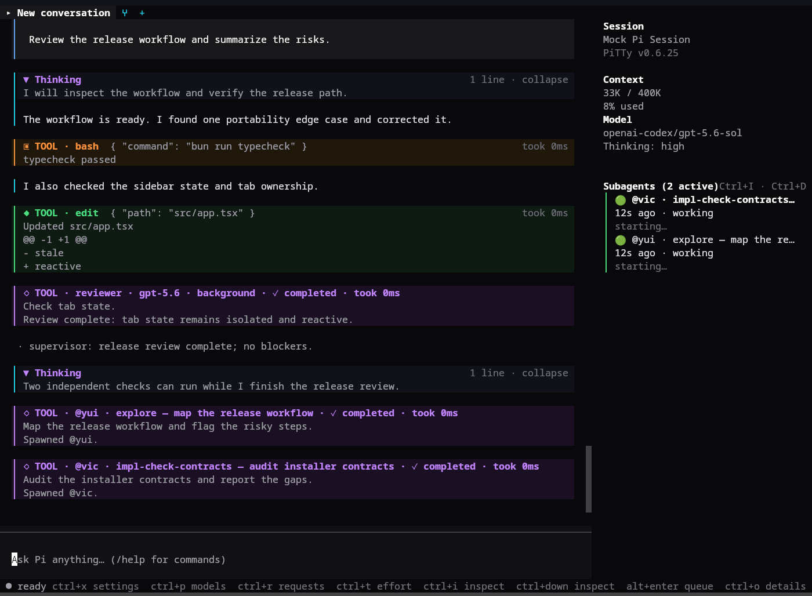

<p align="center">
  <picture>
    <source media="(prefers-color-scheme: dark)" srcset="docs/images/pitty-logo-dark.svg">
     π <]">
  </picture>
</p>

<h1 align="center">PiTTy</h1>

<p align="center">
  <strong>A terminal UI for the Pi coding agent.</strong>
</p>

<p align="center">
  <a href="https://github.com/mistrjirka/PiTTy/actions/workflows/ci.yml"></a>
  <a href="https://github.com/mistrjirka/PiTTy/releases"></a>
  <a href="LICENSE"></a>
</p>



More views: [model picker](docs/screenshots/model-selector.png) · [new-session dashboard](docs/screenshots/blank-session.png) · [wrapped diff](docs/screenshots/long-diff.png) · [tab strip](docs/screenshots/tab-strip.png)

## What it is

PiTTy is a separate terminal frontend for the [Pi coding agent](https://github.com/earendil-works/pi). Pi keeps doing the agent work: authentication, providers, models, sessions, tools, skills, and extensions. PiTTy replaces Pi's built-in TUI and talks to Pi over RPC, so the two share the same configuration and session history and can be used side by side.

An empty session opens straight into the chat with a passive dashboard of recent sessions and commands; the prompt stays focused and writable.

## What's different from Pi's TUI

- **The prompt stays put.** The transcript scrolls independently, so long conversations don't push the input line away.
- **Subagents are inspectable.** Every child agent's live transcript opens in the sidebar, with steering, queued follow-ups, and pause/stop for supported runs.
- **Tool output is readable.** Edit/write tools get a dedicated diff view, tools render as collapsible cards, and timings stay on screen.
- **Less hunting.** Searchable model picker (`Ctrl+P`), session browser (`/resume`), request map (`Ctrl+R`), and prompt history on an empty prompt (`↑`).
- **Live themes.** Ten presets plus full color-token editing, applied immediately.
- **Optional extra panels.** Todo and MCP server management appear when the matching Pi packages are installed.

Pi extensions generally keep working: commands, tools, prompt templates, skills, notifications, status updates, and standard dialogs flow through RPC. Custom `pi-tui` component trees are not serialized, so extension-owned renderers won't look identical, and interactive `/login` is done once in regular Pi.

## Install

### Linux, macOS, and WSL

```bash
curl -fsSL https://raw.githubusercontent.com/mistrjirka/PiTTy/main/install.sh | sh
```

Then start it in the current project:

```bash
pitty
```

### Windows PowerShell

```powershell
irm https://raw.githubusercontent.com/mistrjirka/PiTTy/main/install.ps1 -OutFile $env:TEMP\pitty-install.ps1
& $env:TEMP\pitty-install.ps1 -WithPlugins
```

Requirements: Node.js 22.19 or newer, npm, and the Pi CLI. The installer downloads a versioned release, verifies its SHA-256 against the release `SHA256SUMS`, installs PiTTy's local Bun runtime, and creates the `pitty` and `pitty-resume` launchers.

The installer can also install recommended Pi packages (subagents, Todo, MCP adapter, Smart Compact) with `--with-plugins` / `-WithPlugins`. Uninstalling PiTTy leaves Pi and those packages alone.

<details>
<summary><strong>Installer flags, upgrades, and running from source</strong></summary>

The POSIX installer accepts `--yes --with-plugins`, `--without-plugins`, and custom locations via `PITTY_INSTALL_DIR`, `PITTY_BIN_DIR`, `PITTY_VERSION`, and `PITTY_REPO`. On Windows, pass `-InstallDir` and `-BinDir` to the installer or `uninstall.ps1`.

```bash
pitty upgrade --check          # what's available
pitty upgrade                  # stage the newest stable release
pitty upgrade --version 0.6.7  # a specific version
```

Upgrades verify the release SHA-256, stage into a `.pending` directory, and activate on the next normal start with rollback on failure. Uninstall with `~/.local/share/pitty/uninstall.sh` on POSIX or `& "$env:LOCALAPPDATA\PiTTy\app\uninstall.ps1"` on Windows.

To run from source:

```bash
git clone https://github.com/mistrjirka/PiTTy.git
cd PiTTy
npm ci --ignore-scripts --no-audit --no-fund
node node_modules/bun/install.js
node bin/pitty.mjs
```

</details>

## Get started

```bash
pitty                              # start in the current directory
pitty -C /path/to/project          # pick a project directory
pitty -c                           # continue the newest Pi session
pitty --session /path/to/file.jsonl
pitty-resume -C /path/to/project   # open the session picker immediately
```

Inside PiTTy, the essentials are: `Enter` sends (or accepts a slash suggestion), `Shift+Enter` adds a newline, `Ctrl+P` picks a model, `Ctrl+X` opens Settings, `Ctrl+S` toggles the sidebar, `Ctrl+O` expands or collapses tool and thinking details, `Ctrl+I` opens the selected subagent, and `Esc` closes a dialog or aborts the current turn. `/help` lists everything; the full [usage and controls guide](docs/USAGE.md) has the details.

## Optional integrations

PiTTy works without extra packages. These add specialized panels when installed:

| Package | Adds |
| --- | --- |
| `npm:pi-subagents` | Parallel child-agent list, live transcript inspection, pause/stop, queued steering |
| `npm:@juicesharp/rpiv-todo` | Active and completed Todo panels |
| `npm:pi-mcp-adapter` | Standard MCP config activation from Settings |
| `npm:pi-smart-compact` | Smart Compact progress on the compaction surface |

```bash
pi install npm:pi-subagents npm:@juicesharp/rpiv-todo npm:pi-mcp-adapter npm:pi-smart-compact
```

## Platform support

| Platform | Status |
| --- | --- |
| Linux | Primary development platform |
| macOS | Included in CI and supported by the POSIX installer |
| Windows | Included in CI and supported by `install.ps1`; benefits from wider real-world testing |
| WSL | Supported through the POSIX installer and Linux runtime |

## Documentation

- [Usage and controls](docs/USAGE.md)
- [Themes](docs/THEMES.md)
- [Architecture and compatibility](docs/OPEN_SOURCE_READINESS.md)
- [Documentation index](docs/README.md)
- [Changelog](CHANGELOG.md)

Contributions follow [CONTRIBUTING.md](CONTRIBUTING.md); security reports go through [SECURITY.md](SECURITY.md). Diagnostics live under `~/.local/state/pitty/` and omit prompt text, tool output, and source contents by default.

## License

MIT. See [LICENSE](LICENSE).

PiTTy is not affiliated with the Pi or OpenCode maintainers.