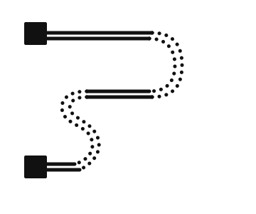
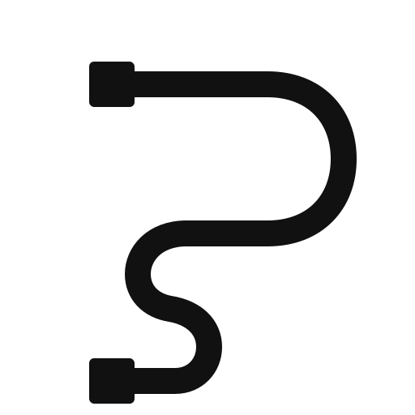
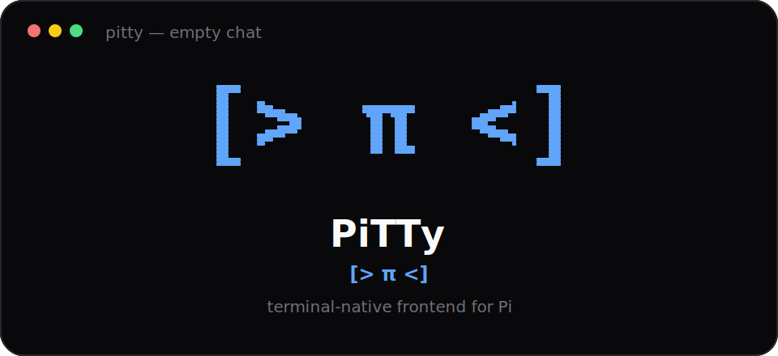

# PiTTy branding

[← Back to README](../README.md) · [Documentation index](README.md)

PiTTy's mark is the **PTY Tail**: two square pseudoterminal endpoints connected by a path that forms a loose `P` and subtly resembles a tail.

## Assets

| Asset | Purpose |
|---|---|
| [`pitty-tail-icon.svg`](images/pitty-tail-icon.svg) | Smooth canonical icon for light backgrounds |
| [`pitty-tail-icon-dark.svg`](images/pitty-tail-icon-dark.svg) | Smooth icon for dark backgrounds |
| [`pitty-terminal-mark.svg`](images/pitty-terminal-mark.svg) | Original double-line and dotted-curve mark for light documentation |
| [`pitty-terminal-mark-dark.svg`](images/pitty-terminal-mark-dark.svg) | Original mark for dark documentation |
| [`pitty-terminal-preview.svg`](images/pitty-terminal-preview.svg) | README/terminal-window composition using vector artwork, not terminal text |
| [`src/ui/logo.tsx`](../src/ui/logo.tsx) | Portable OpenTUI character-cell approximation |

## Original terminal-mark design

<p align="center">
  <picture>
    <source media="(prefers-color-scheme: dark)" srcset="images/pitty-terminal-mark-dark.svg">
    
  </picture>
</p>

This is the design used in the README artwork. Its parallel lines and dotted curves are true SVG geometry, so documentation and raster exports can reproduce it exactly.

## Smooth icon

<p align="center">
  <picture>
    <source media="(prefers-color-scheme: dark)" srcset="images/pitty-tail-icon-dark.svg">
    
  </picture>
</p>

The smooth icon is useful at small application-icon sizes. It uses one rounded path and two rounded-square endpoints with a transparent background.

## Terminal UI approximation

OpenTUI renders fixed character cells rather than arbitrary SVG paths. The exact design therefore cannot be guaranteed pixel-for-pixel in every terminal and font without relying on terminal-specific image protocols such as Kitty graphics or Sixel.

PiTTy instead combines the double-line box-drawing glyph `═` with Braille cells for the dotted bends. This is much closer to the original mock while remaining ordinary Unicode text:

```text
■ ═══════════════════⠒⠒⣄
                        ⠈⢆
                          ⢸
                        ⢀⠎
        ⡠⠔⠒══════════════
      ⢠⠋
     ⡎
     ⠱⡀
       ⠱⡀
         ⠱⡀
           ⠑⢄
■ ═════════⠒⠒⠉
            PiTTy
```

A shorter variant is used when dashboard space is limited. Very constrained terminals display only `PiTTy`, avoiding clipping and broken cell alignment.

<p align="center">
  
</p>

## Usage guidance

- Keep the wordmark capitalization exactly `PiTTy`.
- Use the light or dark asset appropriate for the background.
- Preserve the transparent background and original aspect ratio.
- Leave clear space around the mark of at least one endpoint width.
- Do not replace the square endpoints with circles or add a literal cat face.
- Do not place the mark inside a generic terminal-window icon; the tail itself should remain the identifier.
- In OpenTUI, import the shared `Logo` component rather than copying the glyph strings.

## Raster and social-preview exports

Export PNG files directly from the SVG sources. For a wide social preview, place the mark on a deliberate 1280×640 composition with adequate clear space; do not stretch the square artwork.

GitHub repositories inherit the owner account avatar. PiTTy's repository branding should use README artwork and the separately configurable repository social preview, not a change to the owner's avatar.
